# PracticeGit
The is a Guided Practice for working with Git AFTER your repository has been initialized. This is to get comfortable commiting and pushing changes, and working with branches.

We use this README for the demonstration, but this used for all files in your project.

To get your project initialized in visual studio you can click the Git -> Create Repository menu up top, select your options, then hit create and push. Also click Git -> Push to setup working with your GitHub Repo.

The workspace setup below is to help visualize what is happens when working with Git. But you don't need the Git Changes window open if you don't want with your project, it just demonstrates what `git status` shows.

## Fork This Repo : https://github.com/WCramRTC/PracticeGit
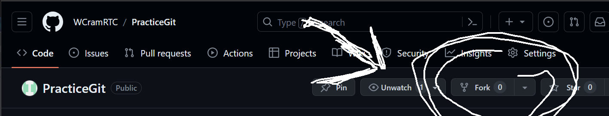

## Prepwork Space

* Open Readme.md : Including in project, look in Solution Explorer
* Terminal : View -> Terminal
	* Appears Below
* GitHub Changes : View -> Github Changes
	* Appears to the Right

	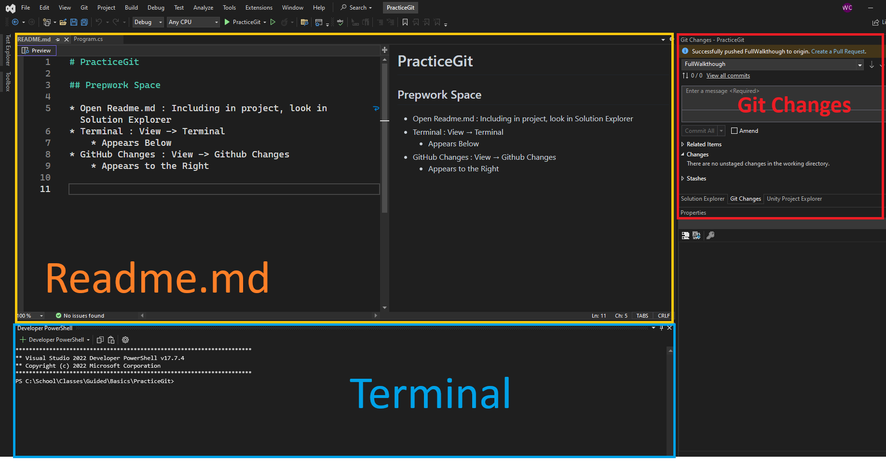

## In the end
You will know how to use git to  
* Commit and Push Changes online
* Create Branches
* Switch Between Branches
* Merge Branches

using command line.

## Step by Step

### 1. ***git status***  
Git tracks changes to your project as you save.  

---
Type your name below   

> What's your name? :  Edna Lynn

And save the file ( ctrl + s )

--- 
In the terminal type 

`git status`

Example : `C:\MySchoolProjects\Git_Project\git status`

***Result***
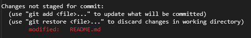

Git status shows us files that have been changed / saved since the last commit.

#### What Visual Studio Sees

Look at your Git Changes window we opened earlier. You can see the same information as git status. Our README.md is located under `changes`.

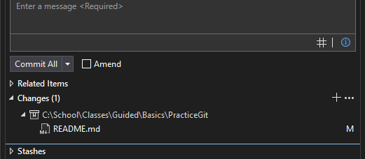

Keep an eye on your Git Changes window to see whats happening as we work.

Lets stage our files to get ready to commit.

---
### 2. ***git add \****

After you've made changes to your project, you need to tell git what changes you want to commit. This is called ***Staging***.

Notice with our `git status`, README.md is in red, that means it is not staged. To stage it, in terminal type

`git add *`

> We use the git keyword, followed by the command add, then a astrix *. The astrix is a symbol commonly used to indicate ALL. So git add * means add all files.

Then type `git status` again

***Result***
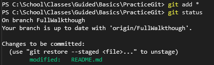

You should now see our README.md in green. This means it is ***Staged***. Git knows that we want to commit this file.

You can also do individual files, or folders. But I use `git add *` most of the time.

#### What Visual Studio Sees

Our Git Changes has now moved our README.md under `staged changes`.
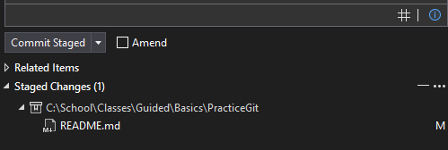

Lets commit our changes with a message.

---
### 3. ***git commit -m "Message"***

Now that we have changes staged we can "commit" them.

> ***What IS commit:***  
Commit saves your current project changes to git. You can see a list of all your commits by opening View -> Git Repository.
>
>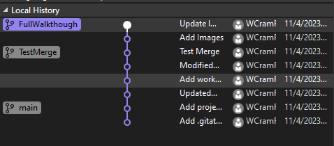  
> Each commit is a version of my project I could revert to if something broke.

Now with our README.md staged, lets commit our change.

In terminal type

`git commit -m "Update README.md"`

> We have our git keyword, followed by the command "commit". Next we have -m. This is a paremeter which says we want to include a message. Followed by double quotes and our message "Update README.md".  
>
> You can do git commit without -m, but then it will just ask you for a message aftwards, so this is quicker.

Now run `git status`.

***Result***

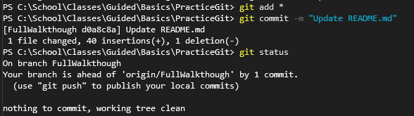 
After we **commit** our **staged change** there should be no files in our `git status`. That means git and our project now have the same changes.

#### What Visual Studio Sees

"There are no unstanged changes..."
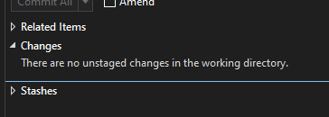

***Imporant*** This is all Local. This means your tracking everything on your current computer, but if something happens to your computer, you will still lose data. Lets `push` our repository online to save our on `GitHub`.

---

4. ***git push***  

`pushing` your repository uploads all your commits to GitHub. This saves them in the cloud. You can can then view your repository in your GitHub account.

In terminal type

`git push`

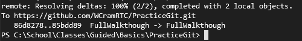 

> **Imporant** - If you get a message in terminal that says  
	`git push --set-upstream origin main` you can either  
> * type that command in. It will setup your local repo with your online repo.   
> * Or in visual studio click Git -> Push. This will connect your repository with your GitHub account the first time.  
Your `git push` will now will like normal on this project.

That's it! Check out your GitHub account and look at your repository. You should see your project, and all your changes.

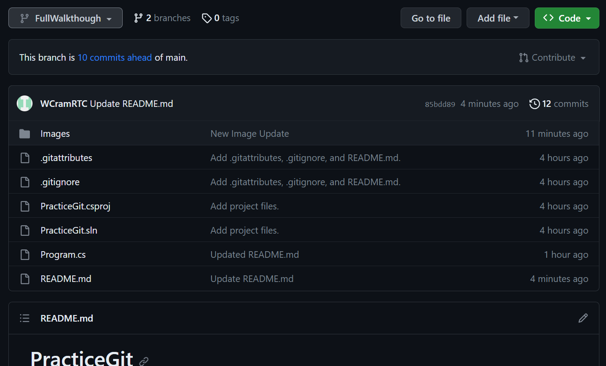 

And that's what it takes to use Termianl To Commit and Push your repo online.

---
### Practice

#### Your `save, add, commit, push` Workflow

Type your favorite color below:
> What's your favorite color: Replace this text
Then save.

Now do the following in terminal, one command at a time

```
	git status
	git add *
	git commit -m "Update README.md"
	git push
```

You should have seen what changes need to be staged, staged them, commited your README changes, and pushed them online.

One more time

What do you want to program when you graduate?
> What do you want to program? Replace this and save

Then
```
	git status
	git add *
	git commit -m "Update README.md"
	git push
```

Congrats. You can work with Git on Command Line.

---
## Git Branches
Git Branches allow you to crate / test new features on your project, without worrying about breaking your currently working project.

### 1. Create a new branch

In terminal type   
`git branch`

This displays your branches. By default you have 1, `main`. This is highlighted in green.

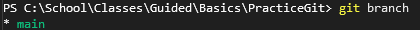

Any commits we make are saved to the main branch. Lets create a new one.

In terminal type

`git branch MyNewBranch`

followed by

`git branch`

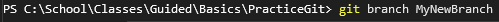
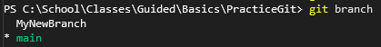 

You can see we have our new branch, named `MyNewBranch` listed. But we are still on our main branch ( main is still green ).

#### What Visual Studio Sees

You can also see what branch your currently on in Visual Studio, in the bottom right corner. The branch were on is always displayed ( here it's main ), clicking on it will display all of our branches.  

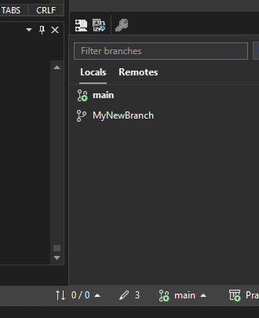 

This is how we create a new branch. Next we see how to switch to our new branch.

### 1. Switch branches

In terminal type `git branch` again to see our branches.

 

We are now going to switch to our new branch, `MyNewBranch`.

In terminal type

`git checkout MyNewBranch`

> `checkout` is the command that tells git you want to switch branches.

Followed by `git branch`

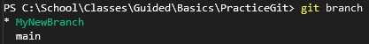 

You will now see MyNewBranch highlighted in green. This tells us were on our new branch.

Now any commits we make will be saved to our, `MyNewBranch` branch, not to main.

- Main Branch
Test it out:
> What is todays date? : 11/4/23

And do our standard commit workflow.
```
	git status
	git add *
	git commit -m "Update README.md"
```

**Note** : You do not need to push your branches unless you want them online. You can just commit and leave them local. But it doesn't hurt to have a backup.

To demonstrate what happend, we will have you `checkout main` again.

In terminal type

`git checkout main`

`MyNewBranch`  
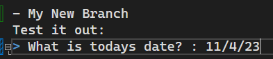   
`Main Branch`  
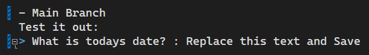 

You'll see that our text reverts back to the old change! This is what git does, it will revert your code to the most recent commit on the branch. Since we changed the text in `MyNewBranch` but not `main` it doesn't show our change.

> **Important** Always keep track of what branch you want and are working on. It's easy to get things mixed up.

***Result***

You you can now create a new branch, switch between branches, and start working on a new one. For our last step we will take a look at **Merging** your new branch into your main.

### Pro Tip : You can use `git checkout -b BranchName` to make a new branch and switch to it in one step instead of two.

### 2. Merging Branches
After we are done working on our **feature** branch, `MyNewBranch`, we want to merge it back to main. Merging branches combines the `commits` from one branch with another. This adds brings your new feature into your new branch, and adds the `commits` to your current branch. In the end it should look like you were working on a single branch the whole time.

In terminal do `git branch` and make sure you are current in your `main` branch. If not, do `git checkout main`.

We are now going to **MERGE OUR `MyNewBranch` INTO OUR `main`**

In terminal

`git merge MyNewBranch`

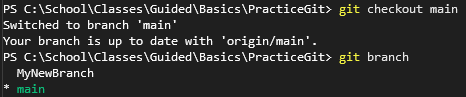 
 

If everything worked properly, you should now see the change you made on `MyNewBranch` on `main`.

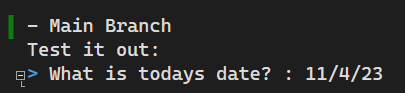

You can `push` like normal, keep working on your main, or create new branches to work on. 

> You don't need to delete your other branch, but if you want you can do
> * `git branch -d MyNewBranch` - If you commited all your changes  
> or
> * `git branch -D MyNewBranch` - If you don't want to merge and just want to delete on the branch. **Be careful with this one**

We only use branches to create and test new features, but we tend to merge our code back into main afterwards, as this is our full, complete project. 

Where you work might have a few different steps, but this is the standard practice.

> 1. Make a new branch from main
> 2. Work on your feature on the new branch
> 3. Merge your feature into main when complete


### Practice

#### Your Git Branch workflow

Lets get some practice. You are going to

1. Create a new branch, `GreatFeature`.
2. Switch to the `GreatFeature`
3. Save and Commit to `GreatFeature`
4. Switch back to `main`.
5. Merge `GreatFeature` into `main`.

---

1. `git branch GreatFeature`
2. `git checkout GreatFeature`
3. Change, save, and commit the following text  

What school are you attending?
> What school are you going to? Change this, save and commit

4. `git checkout main`
5. `git merge GreatFeature`

You should see your answer from GreatFeature on your main.

And that's it! This is your workflow for working on a branch.

This seems like a lot, but it becomes second nature with practice. You will run into problems, all programmers do. But you'll gain experince and be using command line like a pro in no time. Good luck!

---
## Keywords
* `git` - Used to access git commands
	* `git <command> <paremeter>`

### Commands

Git status
* `status` - view which files have changed
	* `git status`

---
Commiting and Pushing your changes
* `add *` - Stage your current changes
	* `git add *`  
* `commit -m "Message"` - Commit your current changes with your "Message"
	* `git commit -m "Your Message"`
* `push` - Push your local commits to Github
	* `git push`

---
Working with Branches
* `branch` - Displays all branches ( current branch in green )
	* `git branch`
* `checkout -b BranchName` - Creates a new branch and switches to it
	* `git checkout -b MyNewBranch`
* `checkout branchName` - Switch between branches
	* `git checkout main` - switch to main branch
* `merge branchToMerge` - Merge a different branch into current branch
	* `git merge branchToMerge`
	

--- 

# Submission
Submit Your Repository URL in the TextBox
